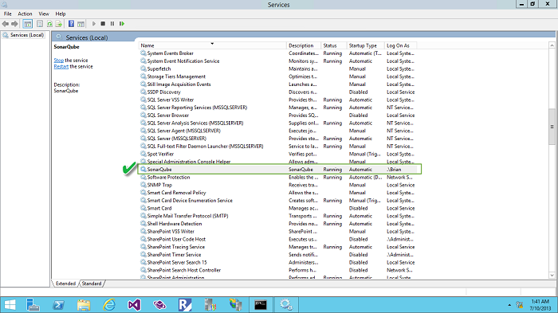
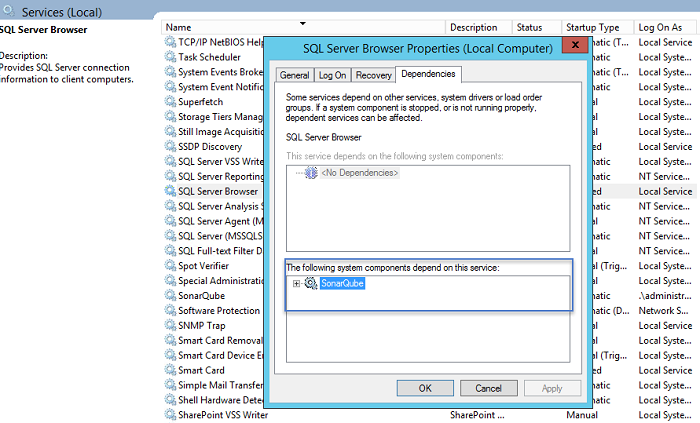
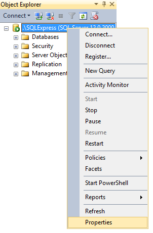
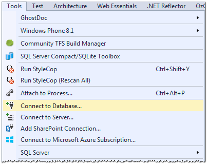
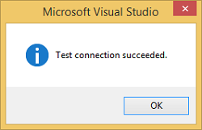

# Additional Configurations

### Running SonarQube as a Service on Windows

1. **Uninstall**
	- To **uninstall** the NT services, run the following batch file using Run As Administrator.

		Example:

		```
		<SonarQube_Install_Directory>\bin\windows-x86-64\UninstallNTService.bat
		```

2. **Install**
	- To **install** the NT services, run the following batch file using Run As Administrator.

		Example:

		```
		<SonarQube_Install_Directory>\bin\windows-x86-64\InstallNTService.bat
		```

		
3. **Service Account**
	- Remove the local system account usage and replace it with an administrative account.

		

4. **Start service**
	- Make sure you have closed all running non-service instances of **SonarQube Server.**
		- To **start** the service use the Services Console or run the following batch file using Run As Administrator.

		Example:

		```
		<SonarQube_Install_Directory>\bin\windows-x86-64\StartNTService.bat
		```

		

5. **Validate**
	- From Services Console make sure the service is running correctly.

		
	- Validate that you are able to browse **SonarQube portal**.
6. **Inter-service dependency**
	- If **SonarQube server** is installed on the same machine as SQL Server with the SonarQube database, you need to make sure that SQL Server is started before the SonarQube service. In addition, the default jdbc driver install with SonarQube requires the SQL Brower Service to be running.
	- Assuming you’re using the default SQL Server instance **MSSQLSERVER**, open the command prompt in administrative mode and run the following command to ensure both the SQL Server and SQL Browser Service are started before the SonarQube service.

		```
		Example: sc config SonarQube depend=MSSQLSERVER/SQLBrowser
		```

		

	**>> NOTE >>** If you are using a named SQL instance, you can check the name of the service by locating it in the Services Console and viewing its properties. The **Service name** to use if given on the **General** tab
	- Validate that the inter-service dependency has been added successfully by navigating to the **SonarQube service** and check the **Dependencies** tab.

		

## Configure SonarQube to use Microsoft SQL Database

**>> NOTE >>** For the purposes of this section, we will assume that you have already installed supported version of Microsoft SQL Server (SQL Server 2012) as part of Team Foundation Server installation.
- As mentioned in the database requirements above, SQL Server must be set to **UTF-8** and the language set to **English**. The collation must be set to **case-sensitive** (CS) and **accent-sensitive** (AS).
- To enable TCP connection for SQL, you must open the SQL Server Configuration Manager and enable TCP/IP within SQL Server Network Configuration  and set it to use static port 1433.
- Once a database has been created, you must create a new database user with permissions to create, update, and delete objects within this database.

### Preparations

Before you get to the task of creating a new database for SonarQube, you need to complete a few preparations.

1. **Launch SSMS**
	- Launch **SQL Server Management Studio** (SSMS).
	- Connect to the SQL Server instance on which you plan to create the database.

		```
		Example: .\\SQLExpress
		```

2. **Check collation**
	- Right-click on the **database server** node and select **Properties**. 

		
	- This will display the Server Properties dialog.
	- Click on the **General** node and make a note of the current Server Collation setting.
	- For example, in the screenshot below, the collation setting is currently set to **SQL\_Latin1\_General\_CP1\_CI\_AS**.

		
	- You need the collation to be both **case sensitive** (CS) and **accent sensitive** (AS).
	- If either is different, you will need to be sure to select the case-sensitive version when you set the collation for the database you will be create.
3. **Check authentication**
	- Click on the **Security** node.
	- Since, by default, SonarQube utilizes SQL Authentication we need to ensure that Server Authentication is set to **SQL Server** and **Windows Authentication** mode as shown in the screenshot below.

		

### Walkthrough

1. **Create database for use by SonarQube**
	- Within SSMS right-click on the **Databases** node (just under the Server\\Instance node).
	- Select New Database…

		
	- In the **General** node, set the Database **Name** to **Sonar**.

		

	- In the **Options** node, click on the **Collation** drop-down list and look for the **case-sensitive** (CS) and **accent-sensitive** (AS) variant of the server collation you made note of above.

		
	- Click **OK** to create the initial database.

2a. **Setup Integrated Security**
       - Download the Microsoft SQL JDBC Driver 4.1 package from http://www.microsoft.com/en-us/download/details.aspx?displaylang=en&id=11774 
       - Copy sqljdbc_auth.dll to any folder in your path. You have to copy the 32 bit or 64 bit version of the dll depending upon the architecture of your server machine. 
       - Ensure that sonar.jdbc.username or sonar.jdbc.password properties are commented. If these properties are set, SonarQube will use SQL Authentication.


2b. **Create database user for SonarQube**
	- This step is required only if you want to use SQL Authentication.

	- Within SSMS right-click on the **SecurityLogins** node (just under the Server\\Instance node).
	- Select 

		
	- Select the **General** node.
	- Set the Login Name – e.g. SonarUser
	- Select SQL Server Authentication and provide a Password.
	- Uncheck Enforce password expiration.
	- Set the Default Database to the Sonar database you created.
	- Set the **Default Language** to **English** 

		
	- In the **User Mapping** node, ensure the **SonarUser** has been mapped to the **Sonar dat**abase and check the **db\_owner database role membership**                                                                     

		
	- Click **OK** to complete the new user setup.

3. **Test connection**
	- Launch Visual Studio and select **Tools**, **Connect to Database...**

		
	- Select **Microsoft SQL Server** as the Data Source.

		
	- On the **Add Connection** dialog.
		- Set the Server Name to your SQL Server instance (e.g. **.\\SQLExpress**)
		- Select the appropiate authentication method.
		- If you are using SQL Server Authentication, provide the **User Name** and **Password** you created.
		- Enter the name of the database you created, for example Sonar.

			
	- Click on Test Connection.
	- You should see the following dialog.

		

## Secure the SonarQube Portal

By default, the SonarQube portal allows anonymous access, although SonarQube does provide a complete authentication and authorization mechanism to manage security. As users of the portal will be able to view the analyzed source code, it is recommended that the anonymous access to the site not be permitted.

See [Security](http://docs.sonarqube.org/display/SONAR/Security) section on the SonarQube site for more information.
