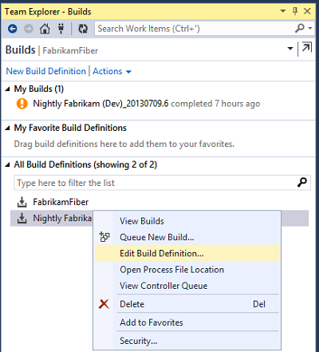
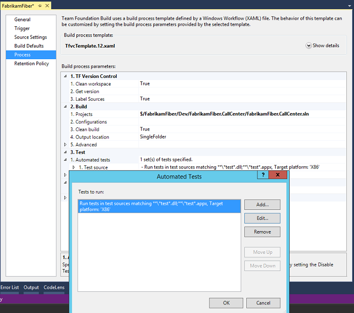
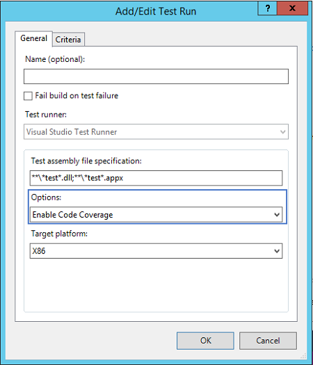
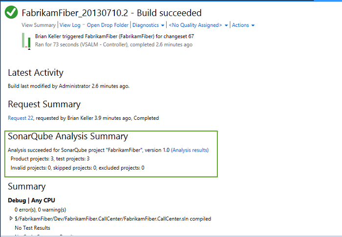
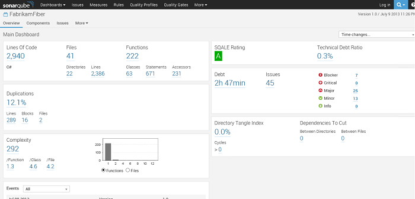

# Analyze .Net Projects From Team Foundation Server 2013
### Mapping Build Definitions to SonarQube projects

SonarQube uses *Projects* to organize analysis results by logical application, where an application can consist of a number of *modules* (assemblies). It is not currently possible to upload partial analysis results for a SonarQube Project. For example, if SonarQube project *X* consists of assemblies *A*, *B* and *C*, it is not possible to build, analyze and upload data for *A* and *B*, and later to build, analyze and upload data for *C*.

This means that a Build Definition must build and analyze all of the assemblies that are in that SonarQube Project.

### Update the build definition

**>> NOTE >> Assumptions**:
- One of the standard Team Build workflow templates for TFS2013 (GitTemplate.12.xaml or TfvcTemplate.12.xaml) and that the standard Microsoft build targets are used. Users who have customized either the build targets or workflow templates may need to modify the following steps to take account of their customizations.
- You have permissions to create or modify a Build Definition. If you do not, contact your Team Foundation Service administrator.

1. **Edit build definition**
	- Open the Team Explorer in Visual Studio.
	- Check that you are connected to the correct Team Foundation Server.

		
	- Click on the **Builds** tab.
	- The displayed **Builds** page will show information about recent builds and any build definitions that exist.
	- Right-click on the build definition you want to modify and select **Edit Build Definition…** 
	- This will display the Build Definition in a document window.

		

2. **Edit advanced build settings**

	- Click on the Process section, then, within the **2. Build** section, expand the **5. Advanced** section.
	- This will display the advanced build settings.

		
	- Set the following properties in the Advanced section:
		- Set the **Pre-build script path** to the full path to MSBuild.SonarQube.Runner.exe.
		- Set the **Pre-build script arguments** to contain the following four arguments:
			- begin
			- /key:{the **project key** of the SonarQube project to which the build definition relates}
			- /name:{the **project name** of the SonarQube project}
			- /version:{the **project version** of the SonarQube project}

			*The aliases /k:, /n: and /v: can also be used.*

			**>>NOTE >>** If any of the arguments contain spaces then that argument needs to be surrounded by double-quotes e.g. **/name:”My Project Name”**.
		
		- Click on the expander for the **2. Advanced** section under **3. Test** to display the advanced test settings.
		- Set the **Post-test script path** to the full path to MSBuild.SonarQube.Runner.exe
		
			**>> NOTE >>** The pre and post script paths refer to the same executable.

		- Set the **Post-test script arguments** to contain the following argument:
			- end

3. **OPTIONAL - Configure code coverage**

	-  Carry out the following actions if you want to collect code coverage data for tests:
		- Click on the expander **3. Test**
		- Select the **1. Automated tests** line
		- Click on the ellipsis to bring up the **Automated Tests** dialogue.

			
		- Click on **Edit** to bring up the **Add/Edit Test Run** dialog
		- Select **Enable Code Coverage** from **Options** drop-down.

			

		- Click OK to close the dialogs.

			**>>WARNING >>** It is possible to drill down through the **1. Automated tests** sections to locate a drop-down for **Type of run settings** in which one of the options is **CodeCoverageEnabled**. However, at the time of writing choosing **CodeCoverageEnabled** from the drop-down does not generate coverage results, due to a bug. See [TFS 2013 - No Code Coverage Results](http://stackoverflow.com/questions/24016217/tfs-2013-no-code-coverage-results) on StackOverflow for more info. 

4. **Validate and save build settings**
	- The following screenshot shows how the build definition should look at this point.

		

	- **Save** the build definition.

### Test the modified build definition

**>>NOTE >> Assumptions**
- If you have not already created a SonarQube Project with Project Key specified in the Build Definition, a new SonarQube Project will be created automatically, when analysis results are uploaded to SonarQube.
- In this case, the initial analysis will use the default SonarQube Quality Profile.
- If you want the initial analysis to be performed using a different Quality Profile, you will need to create and configure the SonarQube project before running the first analysis.                               
- See the SonarQube documentation on [Provisioning Projects](http://docs.sonarqube.org/display/SONAR/Provisioning+Projects) for more information.

1. **Test the build**
	- Right-click on the build definition in the Team Explorer window.
	- Select **Queue new build…** from the menu.

		
	- A dialogue box will appear presenting various build options.
	- Click on **Queue** to accept the default options and start the build.

		**>> NOTE >>** The build may take some time to complete, depending on the complexity of your application.

	- When the build is complete, the build summary Page will indicate whether the build was successfully or not.
	- If the build completed successfully there will be a section entitled **SonarQube Analysis Summary**.

		
	- The section contains a link to the SonarQube portal for relevant SonarQube Project.

		

### Troubleshooting

#### Build did not complete successfully and build summary contains one or more errors.

Try modifying the build definition to remove the SonarQube.MSBuild.Runner.exe entries in the pre- and post- script sections. If the build completes successfully, then the errors are related to analysis.

Most analysis-related configuration or execution errors will cause the build to fail and will be appear on the Build Summary. Additional information can be found by viewing the logs or diagnostic information (i.e. by clicking on **View Log**, or **Diagnostics** at the top of the Build Summary page).
