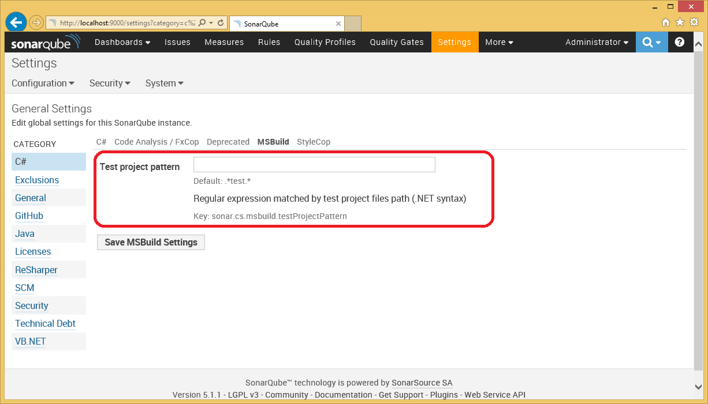

# Appendix 2: Configuring the SonarQube Scanner for MSBuild

## Contents

- [Supplying additional analysis settings](#supplying-additional-analysis-settings)
- [Classifying projects as test projects](#classifying-projects-as-test-projects)
- [Excluding artefacts from analysis](#excluding-artefacts-from-analysis)
- [Using Roslyn analyzers with the SonarQube Scanner for MSBuild](#using-roslyn-analyzers-with-the-sonarqube-scanner-for-msbuild)

## Supplying additional analysis settings

The analysis process can be configured by passing additional analysis settings to the *SonarQube Scanner for MSBuild*.
Global settings can either be passed on the command line or in a settings file.
Project-level settings can be set in the MSBuild project file.

### Passing additional global settings on the command line

Individual global settings can be supplied on the command using the */d* switch: 

```
	MSBuild.SonarQube.Runner.exe /v:1.0 /n:"My project" /k:my.project /d:sonar.host.url=http://myServer:9001
```

### Passing additional global settings in a settings file

Additional settings can also be supplied in a settings file. The location of the settings file can be specified on the command line using the */s* switch:

```
	MSBuild.SonarQube.Runner.exe /v:1.0 /n:"My project" /k:my.project /s:C:\SharedSettings\SonarQube.Analysis.xml
```

If the */s* command-line switch is not supplied then the *SonarQube Scanner for MSBuild* will look for a default settings file called *SonarQube.Analysis.xml* in the same directory as the MSBuild.SonarQube.Runner executable file.
The default settings file shipped with the *SonarQube Scanner for MSBuild* contains placeholders for the most commonly-required settings and can be used as a template for custom settings files.

### Passing additional non-global settings in a project file

Non-global (i.e. settings specific to a particular MSBuild project) can be specified in the MSBuild project file for the project.
For example, the *MSBuild.SonarQube.Integration.targets* file sets the *sonar.stylecop.projectFilePath* property as follows:

```xml
<ItemGroup>
	<SonarQubeSetting Include="sonar.stylecop.projectFilePath">
		<Value>$(MSBuildProjectFullPath)</Value>
	</SonarQubeSetting>
</ItemGroup>
```

It should only be necessary to use this mechanism in cases were a plugin requires different values for each project that is being analysed, as is the case with the *StyleCop* plugin.


### Order of precedence of analysis settings
If the same setting is supplied in multiple places then the value that is used is determined using the following order of precedence (highest to lowest):

	- command line settings specified using /d
	- settings in a SonarQube.Analysis.xml file (either the default settings file or one specified using the */s* command-line switch)
	- settings specified in an MSBuild project file
	- settings fetched from the SonarQube server

## Importing Code Coverage reports

See http://docs.sonarqube.org/x/CoBh for details on how to import Code Coverage reports into SonarQube.

## Importing Unit Test Execution reports

See http://docs.sonarqube.org/x/DIBh for details on how to import Unit Test Execution reports into SonarQube.

## Importing ReSharper Command Line Tools reports

See http://docs.sonarqube.org/x/lwAW for details on how to import ReSharper Command Line Tools reports into SonarQube.

## Classifying projects as test projects

SonarQube analyses test projects and product projects differently so it is important that projects are correctly classified as being either test or product projects.

The *SonarQube Scanner for MSBuild* will automatically recognise MSTest unit test projects as being test projects (because of the presence of a well-known guid in the project file).

Other test projects are recognised by applying a regular expression to the full path of the project file. The regular expression can configured in the SonarQube portal on the settings page for the C# plugin:



Figure – MSBuild settings tab of the C# plugin

The regular expression uses [.Net regular expression syntax][1].

[1]: https://msdn.microsoft.com/en-us/library/az24scfc(v=vs.110).aspx

In version 1.0.1 onwards, the default regular expression treats projects that contain the word "test" in the project file name as test projects (in version 1.0, projects that contained "test" anywhere in the path were treated as test projects, but user feedback indicated that this regular expression was not specific enough and incorrectly classified to many projects).

Finally, it is possible to manually classify a project by setting the MSBuild property *SonarQubeTestProject*, e.g.

```xml
<PropertyGroup>
	<!-- Mark the project as being a test project -->
	<SonarQubeTestProject>true</SonarQubeTestProject>
</PropertyGroup>
``` 


## Excluding artefacts from analysis

### Excluding projects from analysis

Certain types of project will automatically be excluded from analysis. For example, [Microsoft Fakes](https://msdn.microsoft.com/en-us/library/hh549175.aspx) generates additional projects during build. These auto-generated projects will not be analysed.

Individual projects can be excluded from analysis by setting the MSBuild property *SonarQubeExclude* to *true* as follows:

```xml
<PropertyGroup>
	<!-- Exclude the project from analysis -->
	<SonarQubeExclude>true</SonarQubeExclude>
</PropertyGroup>
```

See [Appendix 3: Advanced SonarQube Scanner for MSBuild configuration](appendix-3.md) for more information on how *SonarQubeExclude* can be set conditionally at build time.


### Excluding individual files from analysis

Files that are generated by custom tools within Visual Studio are automatically excluded from analysis, such as the *xxx.Designer.cs* file generated from a .resx file:
    
```xml
<Compile Include="Resources.Designer.cs">
	<AutoGen>True</AutoGen>
	<DesignTime>True</DesignTime>
	<DependentUpon>Resources.resx</DependentUpon>
</Compile>
```    

These files are excluded because they are marked as generated by Visual Studio.
It is possible to manually exclude a specific file from analysis by setting the MSBuild metadata item *SonarQubeExclude* to *true* as follows:

```xml
<ItemGroup>
	<Compile Include="MyFile.cs">
		<!-- Exclude the file from analysis -->
		<SonarQubeExclude>true</SonarQubeExclude>
	</Compile>
</ItemGroup>
```    

## Using Roslyn analyzers with the SonarQube Scanner for MSBuild

Microsoft .Net provides a rich code analysis framework referred to as "Roslyn" that makes it easy to write custom code analyzers for C# and VB code.
There are many articles that describe how to write such an analyzer (see for example [this article](https://msdn.microsoft.com/en-us/magazine/dn879356.aspx) on MSDN).

Starting with *SonarQube Scanner for MSBuild* v2.0 and the C# plugin v4.5, it is possible to upload issues found by such custom Roslyn analyzers to *SonarQube*.
No special configuration of the MSBuild projects, the scanner or the C# plugin is required, and it is not necessary for the Roslyn analyzers to be manually installed on the machine performing the analysis. However, it is necessary for there to be a custom *SonarQube* plugin that wraps the custom analyzer to make *SonarQube* and the C# plugin aware of the Roslyn analyzer and the rules that it provides.

If you are using a custom analyzer provided by a third-party, check with them to see if they also provide the *SonarQube* plugin for their analyzer.
If not, or if you are the analyzer author and want to create a *SonarQube* plugin for your analyzers, you can use the [SDK for SonarQube Roslyn Analyzer Plugins](https://github.com/SonarSource-VisualStudio/sonarqube-roslyn-sdk) to generate one. See the documentation in the SDK project for more information.
