# Installation and Configuration
## Installation Topologies 
### Minimum Deployment

-   All TFS Services, SQL Server and SonarQube, including Sonar Runner and Build Controller) hosted on a single computer.
-   Suitable for research, dogfooding and demonstration of entire end-to-end workflow on one machine.

	**>> NOTE >>** In this guide, we will demonstrate the installation and configurations using [Brian Keller's VM](http://aka.ms/ALMVMs), with all components installed on one box. 

### Medium Deployment

- TFS Services and SQL Server are hosted on a single computer and SonarQube (all components) on a separate machine.
- Suitable for evaluation in production or near-production environments.

## Recommended platform configurations

Refer to [System requirements for Team Foundation Server](https://msdn.microsoft.com/en-us/library/dd578592.aspx) and the [TFS Planning, Disaster Avoidance and Recovery, and TFS on Azure IaaS Guide](http://vsarplanningguide.codeplex.com/) for information on hardware and capacity planning recommendations for your Team Foundation Server environment.

## Running SonarQube on Hyper-V and Azure IaaS

While preparing a Virtual Machine that will host SonarQube database, portal and/or Runner workloads take into account the following guidance:

- [For production servers it is recommended to use Fixed Sized disks](https://technet.microsoft.com/en-us/magazine/ff458359.aspx) (instead of dynamic ones); you must estimate accordingly to set apart the right amount of disk space as required.
- For production servers it is recommended NOT to use dynamic assigned memory as this may decrease overall performance in a production setup; a realistic estimate should be made, monitor and adjusted accordingly.
- Follow [SQL Server best practices](http://blogs.msdn.com/b/cindygross/archive/2009/11/20/compilation-of-sql-server-tempdb-io-best-practices.aspx) while setting the SonarQube database, especially in respect of [*tempdb*](https://msdn.microsoft.com/en-us/library/ms175527.aspx) as per the usage expected by SonarQube:
	- Prefer fast disk for *tempdb* file storage.
	- Distribute storage in equally sized data files (starting at 1/2 file per physical processor and up to 8 files).
	- Monitor and size *tempdb* file storage accordingly.
	- Plan for a big size of *tempdb*; approximately 10-12 times SonarQube database size.
- Prefer usage of Windows Server 64 bits, preferably Windows Server 2012 R2.
	- Java JRE (or Java SDK) that supports Server mode and configure SonarQube to support it: editing **sonar.properties** file for sonar.web.javaOpts=**-server** and uncommenting the line by removing the \# at the start of the line.** **More details on [Installing the Web Server Tuning the Web Server](http://docs.sonarqube.org/display/SONAR/Installing#Installing-installingWebServerInstallingtheWebServer)
	- Prefer to configure Sonar Portal as Windows Service. More details on how to achieve this on [Running SonarQube as a Service on Windows](http://docs.sonarqube.org/display/SONAR/Running+SonarQube+as+a+Service+on+Windows)
- Configure rules for opening ports used by SonarQube, with the Windows firewall and Azure endpoints, if applicable.
- You may use general guidance for Performance Tuning Windows Server in your particular environment/scenario. Please refer to [Performance Tuning Guidelines for Windows Server 2012 R2](https://msdn.microsoft.com/en-us/library/windows/hardware/dn529133).
- Review and plan for [best practices for Physical Servers hosting Hyper-V roles](https://technet.microsoft.com/en-us/magazine/dd744830.aspx):
	- Avoid Overloading the Server
	- Ensure High-Speed Access to Storage
	- Install Multiple Network Interface Cards
	- Configure Antivirus Software to Bypass Hyper-V Processes and Directories
	- Avoid Storing System Files on Drives Used for Hyper-V Storage
	- Monitor Performance to Optimize and Manage Server Loading

## Setup SonarQube Server

1. **Download**
	- Download **SonarQube 5.1** from the SonarQube [downloads](http://www.sonarqube.org/downloads/).

		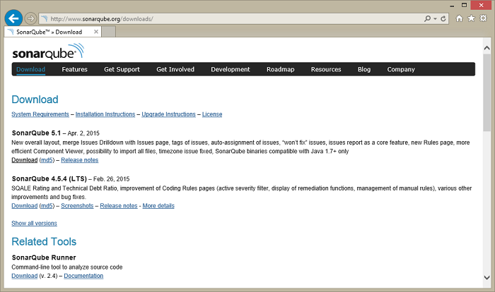
	- As mentioned in the Prerequisites section, a Java virtual machine (JVM) is required.
	- If the installed JVM meets the version requirements listed, you can skip this section. Otherwise, follow the steps below to install Java.
	- Download [Java SE Runtime Environment](http://www.oracle.com/technetwork/java) and make sure you select the one corresponding to your current operation system.

		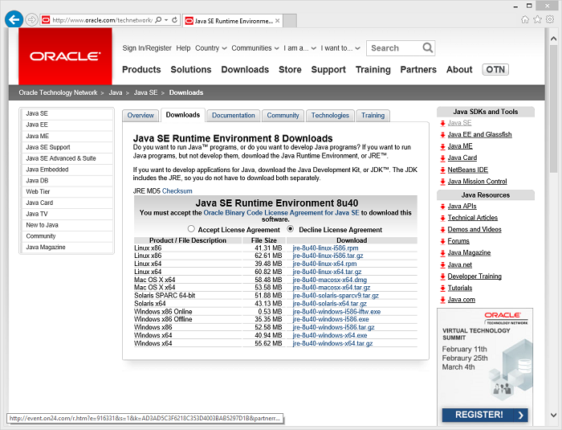
		
		**>> NOTE >>** SonarQube does not require the full Java JDK (Java SE Development Kit) to run- you only need the JRE (Java SE Runtime Environment).
2. **Install**
	- Copy **sonarqube-5.1.zip** and **jre-8u45-windows-xXX.exe** to your Team Foundation Server.
	- Install **Java SE Runtime Environment** on the destination server.

		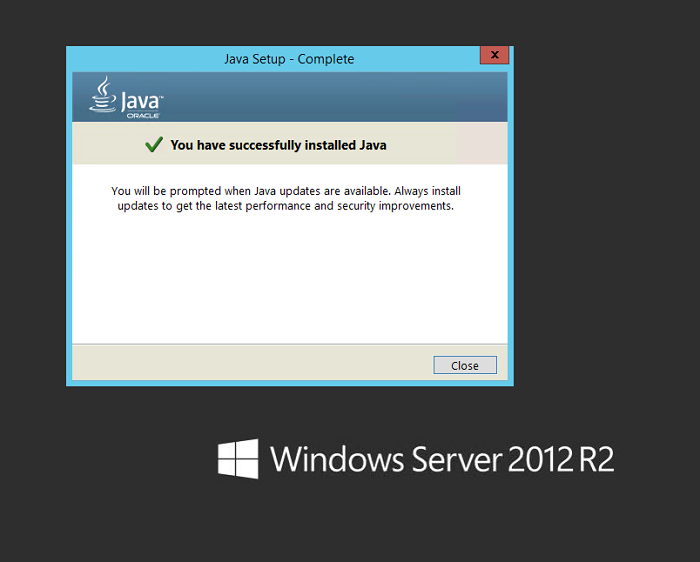
3. **Extract**

	**>> NOTE >>** Before installing and configuring SonarQube install and configure SQL Server according to the instructions in the section [Additional Configurations](additional-configurations.md).

	- Right-click on **sonarqube-5.1.zip**, select Properties and then click on the **Unblock** button
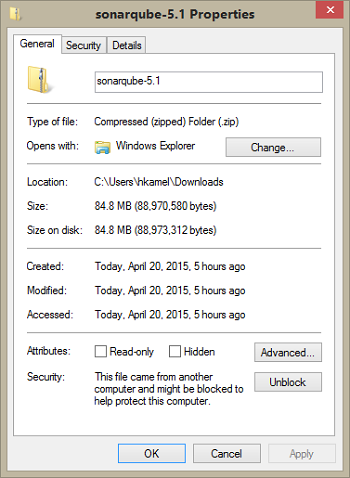
	- Unzip **SonarQube-x.x.zip** on to a drive, for example use **C:\\SonarQube\\SonarQube-5.1**.

		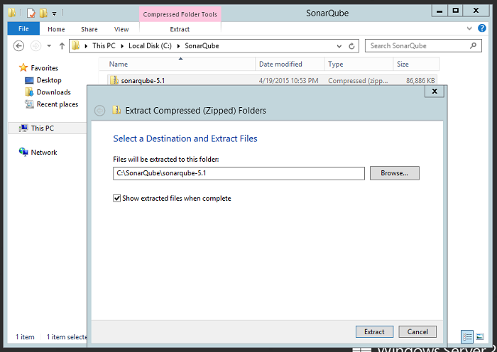
	- At this point, the installation is complete. **Yes, it is that easy**.
	- Proceed to the next section to complete the configuration of SonarQube.
4. **Configure SonarQube**

	- **>> NOTE >>** This walkthrough assumes the use of the BK VM. If, for example, you are using **SQLExpress** instead, you have to update the connection string. Example:

		```
		sonar.jdbc.url=jdbc:sqlserver://localhost;databaseName=sonar;integratedSecurity=true
		```

	- Basic configuration of SonarQube consists of making a few updates to the **sonar.properties** file.
	- This file is located in the conf folder located under the SonarQube installation folder.
		Example: **C:\\SonarQube\\SonarQube-5.1\\conf**.
	- You may not want to do this step if you prefer to go with the default SonarQube port **9000**, if available.
	- In the extracted folder navigate to Conf folder, edit **sonar.properties** file to change the default web port or you may need available port. By default SonarQube uses port **9000**.
	- Make sure to assign an available port for SonarQube, you may need to use the **netstat** command to check the currently in use ports.
	- For the purpose of this walkthrough, we assume port **9000** for the FabrikamFiber demo web site.

		
	- Search for the **\# Web Server** section.
	- Uncomment **\#sonar.web.port** and change the port number to any available port, for example **9090**
 
		

	- Search for and locate the entry for sonar.jdbc.url. There are several copies of this setting based on database type. Make sure you select the entry for Microsoft SQL Server.

		
	- Uncomment (i.e. delete the leading ‘\#’) the sonar.jdbc.url setting circled in the screenshot above and replace the connection string to match the server and database name for your machine. Example: **sqlserver://localhost;databaseName=sonar;

		
		
		**>> NOTE >>** The jdbc driver installed with SonarQube requires the SQL Server Browser to be running. Check that it is running using the Services Console.

	- Save and close the file.

5. <a name="installLatestPluginAnchor"></a>**Download and install latest SonarQube C# plugin**

	- Download the latest sonar-csharp-plugin-X.Y.jar. At the time of writing, all versions of the C\# plugin are available from the [C\# Plugin](http://redirect.sonarsource.com/plugins/csharp.html) page, on the SonarQube site.
	- Use version 4.1 or higher of the plugin.
	- Locate the directory into which the SonarQube was installed e.g. **C:\\SonarQube\\SonarQube-5.1\\**. This directory will have an **extensions\\plugins\\** subdirectory.
	- Copy **sonar-csharp-plugin-X.Y.jar** to this directory from the downloaded package above.
	- Right-click the sonar sonar-csharp-plugin-X.Y.jar and select **properties**.
	- Click the **Unblock** button to ensure the file is unblocked.

6. **Run**

	- Open Command Prompt and change directory (`cd`) to the extracted folder.

		Example:
		```
		cd C:\SonarQube\SonarQube-5.1\bin\windows-x86-64
		```

	- **>> NOTE >>** You need to run the file corresponding to your operating system.
	- Run **StartSonar.bat**
	- **>> NOTE>>** If you are prompted with a Windows Security Alert asking for network access, click on the Allow access button

		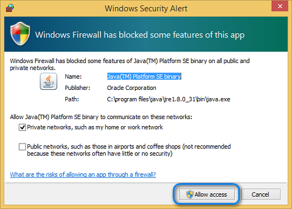
		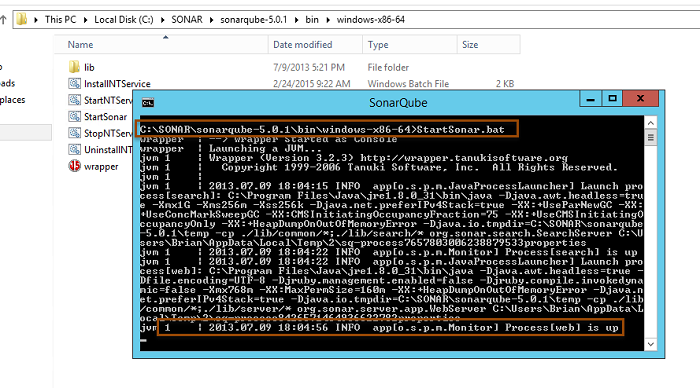 
	- Browse SonarQube web portal using [http://YOUR\_SERVER\_NAME:SONAR\_PORT](http://YOUR_SERVER_NAME:9090). Example: [**http://vsalm:9090**](http://vsalm:9090)

		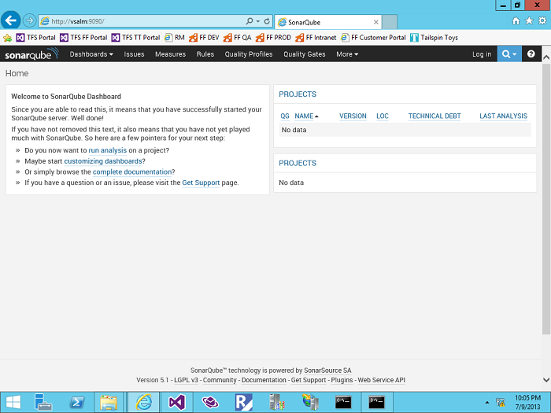
	- You should see the default SonarQube web page as shown above. If not, re-validate settings as shown in the previous sections.
	- If the web server does not start, consult the logs in **C:\\SonarQube\\SonarQube-5.1\\logs** to determine possible issues.
7. **Verify the installed SonarQube C# plugin version**
	- Login to SonarQube using admin credentials.
		- If this is the first time you are using SonarQube, the default admin credentials are:
	
		    `- Username: admin`

			`- Password: admin`

	- If you log in using the default credentials, it is recommended that you change the password.
	- Verify that the C\# X.Y plugin has been correctly deployed, Navigate to **Settings \>System \> Update Center**.

		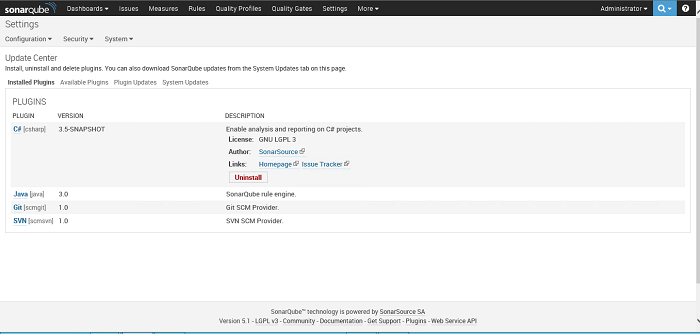
		
	**>> NOTE >>** The screenshot above is based version 3.5. You should see version 4.1 or later.

	**>> NOTE >>** Please refer to section **[Additional Configurations](additional-configurations.md)** for more details on how-to configure additional SonarQube configurations that are required for enterprise level deployment.

## Setup of the MSBuild SonarQube Runner on the Build Agent Machine

- You should install it on any machine that will launch SonarQube analysis (example: development machine and build agent).
- In case of installing MSBuild SonarQube Runner on a development machine or build agent, you need to make sure that Java SE Runtime Environment installed on that machine.
- Java SE Runtime Environment installation is not required if Visual Studio 2015 with Android tooling/Cross platform tools are installed since JDK is being installed part of Visual Studio installation.

1. **Extract**
	- Download the latest **MSBuild SonarQube Runner** from the SonarQube [downloads](http://www.sonarqube.org/downloads/).
	- Right-click on the downloaded .zip file and click on the **Unblock** button.

		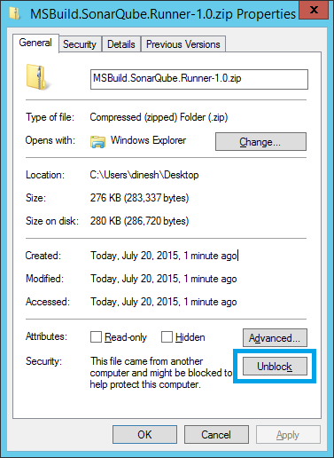
	- Unzip **MSBuild.SonarQube.Runner-[version]** on to a drive.
	Example: **C:\\SonarQube\\bin**

2. **Configure**
	- Edit **C:\\SonarQube\\bin\\SonarQube.Analysis.xml** by specifying the following parameters to run against the SonarQube Server we set up earlier.
	- If you are running SonarQube 5.1.x or less, uncomment and set the following properties:
		- `sonar.jdbc.url`
		- `sonar.jdbc.username`
		- `sonar.jdbc.password`

			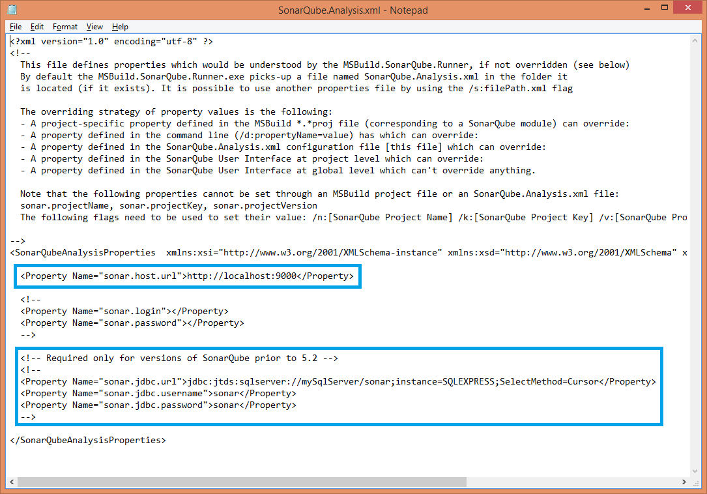

3. **OPTIONAL - Update the `%PATH%` environment variable**

	- Add the directory containing the MSBuild SonarQube Runner executable to the `%PATH%` if you intend to use it from the command line:

		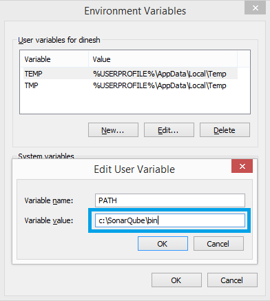

### Settings File Permissions

- Storing passwords in clear text in unsecured settings files is **not** recommended.
- Restrict access to the **C:\\SonarQube\\bin\\SonarQube.Analysis.xml** file by setting appropriate file permissions.
